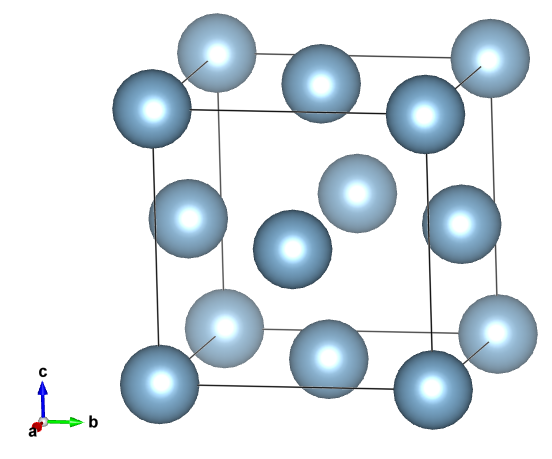
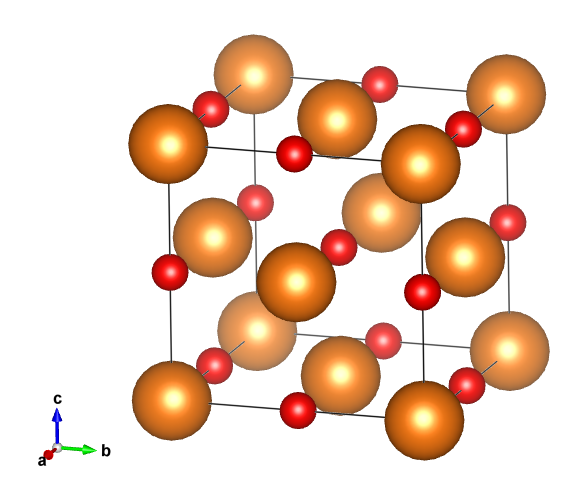
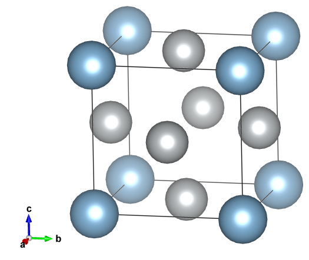

# VESTA
In this session we'll create crytal structures of Al, MgO, and Ni3Al using VESTA. **Bilbao Crystallographic Server** [https://www.cryst.ehu.es/](https://www.cryst.ehu.es/) will be an useful resource to obtain space group information. click on `Space-group symmetry` -> `WYCKPOS` -> `Standard/Default Setting`. You can also enter space group number.

## Al
Al has Fm-3m space group (no. 225), which has a face centered cubic lattice.

**Lattice**: Fm-3m symmetry has 4 lattice points with the following co-ordinates: (0,0,0)+, (0,1/2,1/2)+, (1/2,0,1/2)+, and (1/2,1/2,0)+  
**Basis**: There is 1 basis for _Al_, which is (0,0,0).  
**Crystal structure**: Lattice + Basis, which means we have to add basis to each lattice point to obtain crystal structure.  
When we add the basis to lattice, we obtain (0,0,0), (0,1/2,1/2), (1/2,0,1/2), and (1/2,1/2,0), which are the atomic positions.

## MgO
MgO has Fm-3m space group (no. 225), which has a face centered cubic lattice.

**Lattice**: Fm-3m symmetry has 4 lattice points with the following co-ordinates: (0,0,0)+, (0,1/2,1/2)+, (1/2,0,1/2)+, and (1/2,1/2,0)+  
**Basis**: There is 1 basis for _Mg_, which (0,0,0); and 1 basis for _O_, which is (1/2,1/2,1/2)  
**Crystal structure**: Lattice + Basis, which means we have to add basis to each lattice point to obtain crystal structure.

For Mg: (0,0,0), (0,1/2,1/2), (1/2,0,1/2), and (1/2,1/2,0) are the atomic positions.  
For O : (1/2,1/2,1/2), (1/2,0,0), (0,1/2,0), and (0,0,1/2) are the atomic positions.

## Ni3Al
Ni3Al has Pm-3m space group (no. 221), which has a simple cubic lattice.

**Lattice**: Fm-3m symmetry has 1 lattice points with the following co-ordinates: (0,0,0)+  
**Basis**: There is 1 basis for _Al_, which (0,0,0); and 3 basis for _Ni_, which are (0,1/2,1/2),	(1/2,0,1/2),	(1/2,1/2,0)
 
**Crystal structure**: Lattice + Basis, which means we have to add basis to each lattice point to obtain crystal structure.

For Al: (0,0,0) are the atomic postions.  
For Ni: (0,1/2,1/2),	(1/2,0,1/2),	(1/2,1/2,0) are the atomic postions.

